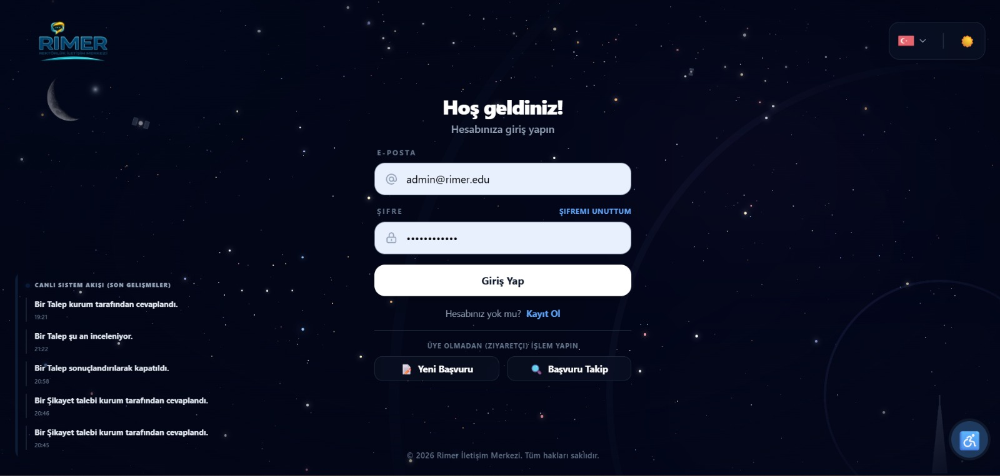
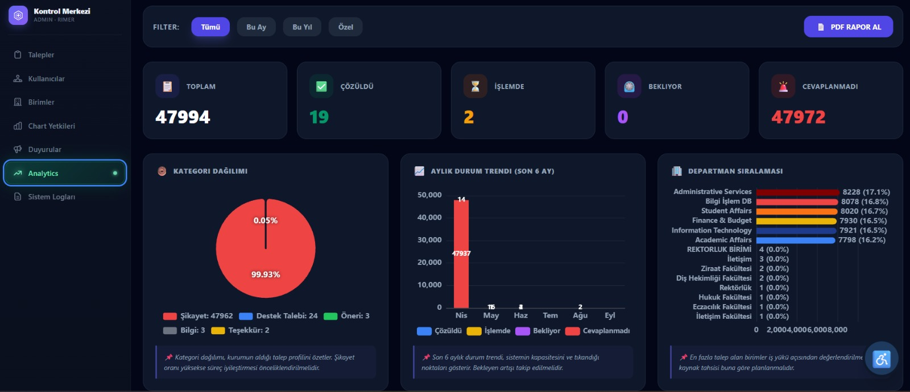
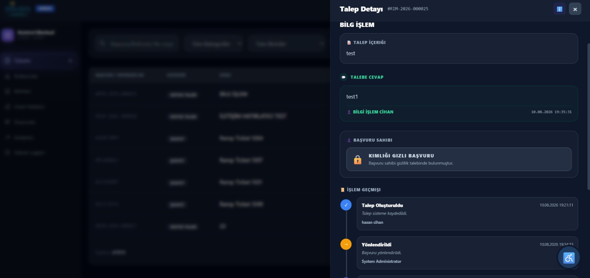
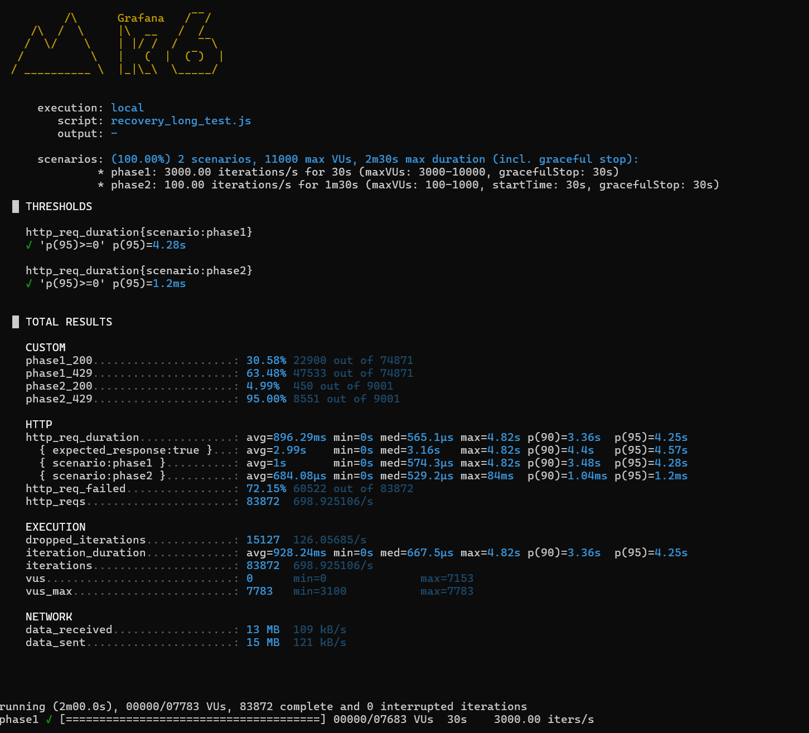
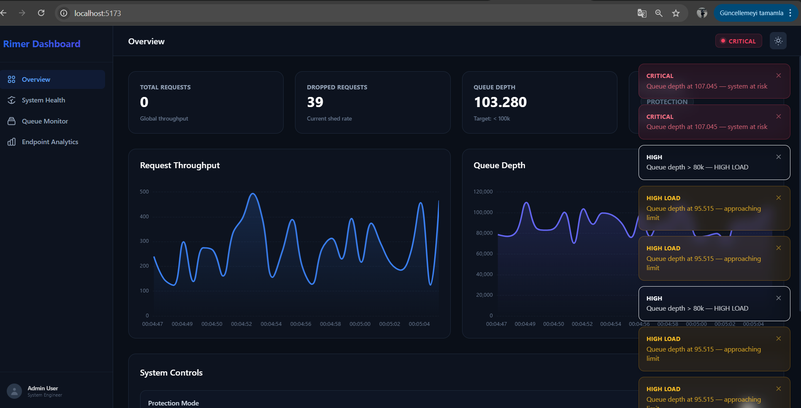

# rimer

A .NET 10 Core, Vue.js, and SQL Server-based request management system inspired by CİMER. It handles university-wide complaints, suggestions, and requests from both internal and external users, featuring smart routing and real-time tracking
